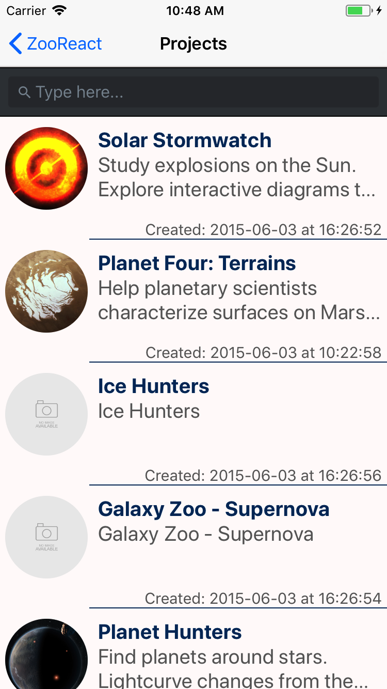

# ZooReact

React Native app that utilizes Zooniverse's API.

  
  
  

The user of the app is able to view all the projects available in Zooniverse's database, as well as the owners of those projects.

Before starting the app, do the following: 
npm install
react-native run-ios

You can start the app from Xcode and/or Android Studio.
